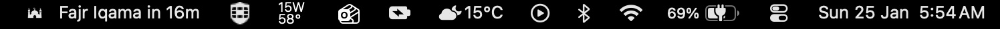
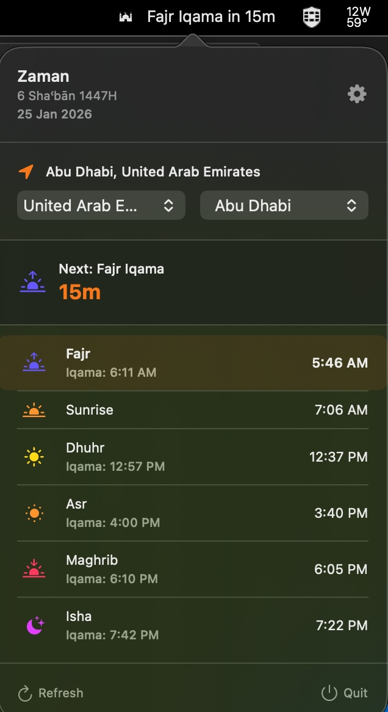
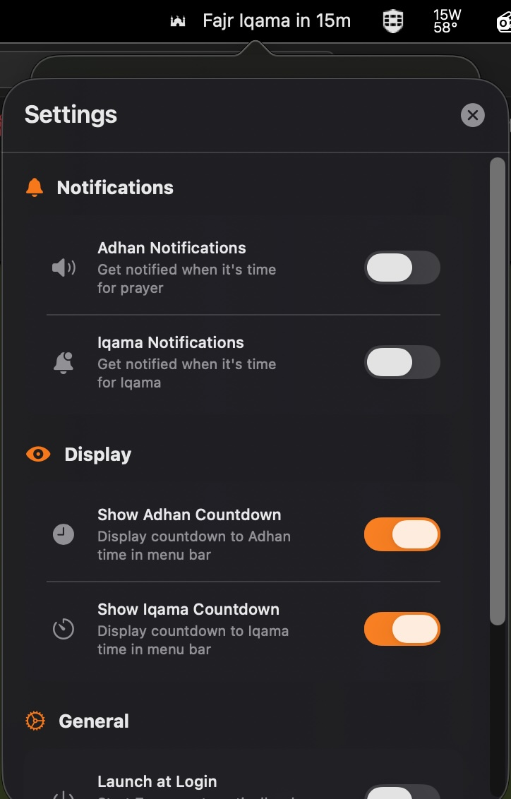

# Zaman ☪️

A beautiful, native macOS menu bar application for Islamic prayer times. Zaman automatically detects your location and displays accurate prayer times with countdown notifications.


## ✨ Features

### 🌍 Smart Location Detection
- **Automatic Location**: Uses macOS location services to auto-detect your nearest city
- **150+ Cities**: Support for major cities across 50+ countries worldwide
- **Manual Selection**: Choose from a comprehensive list of cities organized by country
- **Persistent Settings**: Your location choice is saved across app relaunches

### 🕌 Prayer Times
- **Five Daily Prayers**: Fajr, Sunrise, Dhuhr, Asr, Maghrib, and Isha
- **Accurate Timings**: Powered by Aladhan API
- **Iqama Times**: Separate Adhan and Iqama times for each prayer (except Sunrise)
- **Hijri Calendar**: Displays current Islamic date alongside Gregorian date

### ⏱️ Smart Countdown
- **Menu Bar Integration**: Prayer times display directly in your menu bar
- **Configurable Display**: Toggle Adhan and Iqama countdowns independently
- **Iqama Countdown**: Automatic countdown to Iqama after Adhan period

### 🔔 Notifications
- **Adhan Notifications**: Get notified when it's time for prayer
- **Iqama Notifications**: Separate notifications for congregation time
- **Customizable**: Enable/disable each notification type independently

### 🎨 User Interface
- **Native Design**: Beautiful, modern macOS interface with SwiftUI
- **Light/Dark Mode**: Icon adapts automatically to system appearance
- **Compact Popup**: Quick access to all prayer times and settings
- **Color-Coded Prayers**: Each prayer has its own distinctive color
- **Timezone Awareness**: Shows time difference when selecting different timezones

### ⚙️ Settings
- **Display Options**: Control what appears in the menu bar
- **Notification Preferences**: Customize alert behavior
- **Launch at Login**: Start automatically when you log in
- **Quick Refresh**: Manually update prayer times anytime

## 📸 Screenshots

<div align="center">
  
  
  
</div>

## 🚀 Installation

### Requirements
- macOS 14.0 or later
- Location Services enabled (optional, for auto-detection)

### Build from Source
```bash
# Clone the repository
git clone https://github.com/Danyal-Faheem/Zaman.git
cd Zaman

# Open in Xcode
open Zaman.xcodeproj

# Build and run (⌘+R)
```

## 🌎 Supported Regions

### Middle East
UAE, Saudi Arabia, Qatar, Kuwait, Bahrain, Oman, Jordan, Lebanon, Syria, Iraq, Iran, Palestine, Yemen

### Europe
UK, France, Germany, Spain, Italy, Netherlands, Belgium, Sweden, Norway, Switzerland, and more

### North America
United States (35+ cities), Canada (5+ cities), Mexico, Cuba

### Asia
Pakistan, India, Bangladesh, Indonesia, Malaysia, Singapore, China, Japan, South Korea, and more

### Africa
Egypt, Morocco, Algeria, Tunisia, South Africa, Nigeria

### Oceania
Australia (8 cities), New Zealand

## 📖 Usage

### First Launch
1. **Location Permission**: Grant location access to auto-detect your city (optional)
2. **Manual Selection**: Or choose your country and city from the dropdowns
3. **Configure Settings**: Set your notification and display preferences

### Menu Bar
- **Icon Only**: Shows mosque icon when no prayer is imminent
- **With Countdown**: Displays "Prayer Adhan/Iqama in Xm" when within 30 minutes
- **During Adhan**: Shows "Prayer Adhan" for 60 seconds

### Popup Window
Click the menu bar icon to see:
- Current Hijri and Gregorian dates
- Your selected location with timezone difference
- Next upcoming prayer with countdown
- Complete list of today's prayer times
- Refresh and Settings buttons

### Settings
Access via the gear icon:
- **Notifications**: Enable/disable Adhan and Iqama alerts
- **Display**: Show/hide countdowns in menu bar
- **General**: Launch at login preference

## 🛠️ Technology Stack

- **Language**: Swift 5.0
- **Framework**: SwiftUI
- **Architecture**: MVVM (Model-View-ViewModel)
- **API**: [Aladhan API](https://aladhan.com/prayer-times-api)
- **Location**: CoreLocation
- **Notifications**: UserNotifications framework
- **Persistence**: UserDefaults

## 🗺️ Roadmap

- [ ] Custom Iqama time adjustments
- [ ] Multiple calculation methods support
- [ ] Widget support
- [ ] Prayer time history
- [ ] Multiple location bookmarks
- [ ] Export prayer times to calendar

## 🤝 Support This Project

If you find Zaman useful, consider supporting its development:

<a href="https://www.buymeacoffee.com/danyalfaheem" target="_blank">
  
</a>

Your support helps maintain and improve Zaman. Thank you! 🙏

## 🐛 Bug Reports & Feature Requests

Found a bug or have a feature idea? Please [open an issue](../../issues) with:
- Clear description of the issue/feature
- Steps to reproduce (for bugs)
- Expected vs actual behavior
- macOS version and app version
- Screenshots if applicable

## 📄 License

This project is licensed under the MIT License - see the [LICENSE](LICENSE) file for details.

## 🙏 Acknowledgments

- Prayer times data provided by [Aladhan API](https://aladhan.com)
- Mosque icon from [Flaticon](https://www.flaticon.com)
- Inspired by the Muslim community's need for accessible prayer time tools

## 📮 Contact

- **Issues**: [GitHub Issues](../../issues)
- **Email**: danaylfaheem@gmail.com

---

<div align="center">
  Made with ❤️ for the Muslim community
  <br>
  <sub>© 2026 Danyal Faheem. All rights reserved.</sub>
</div>
